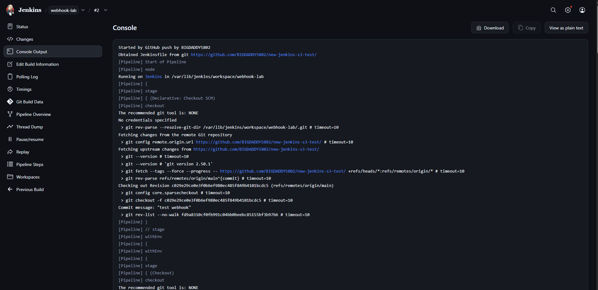
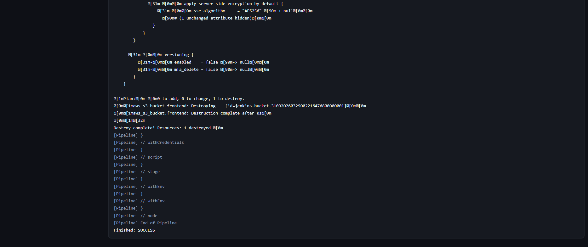
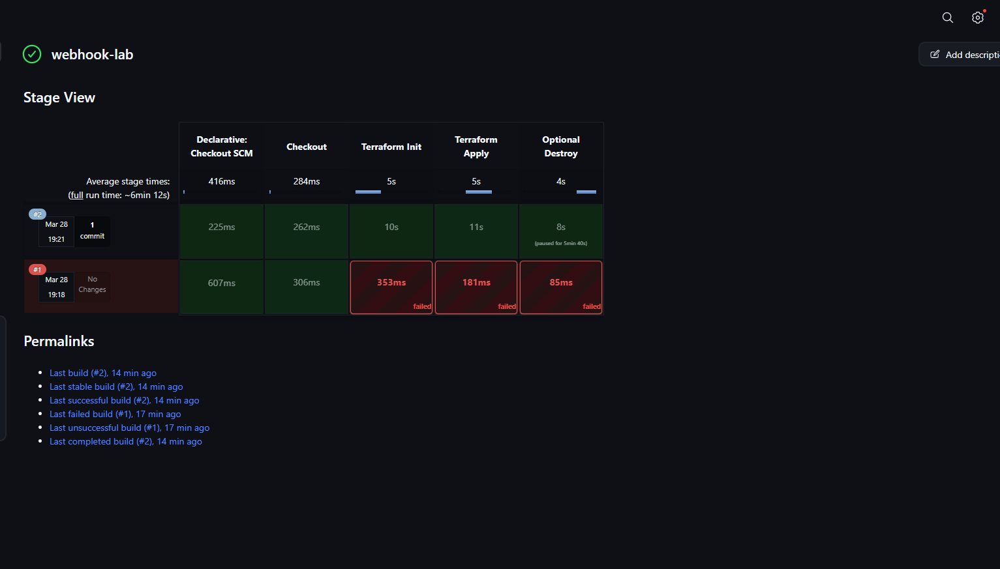
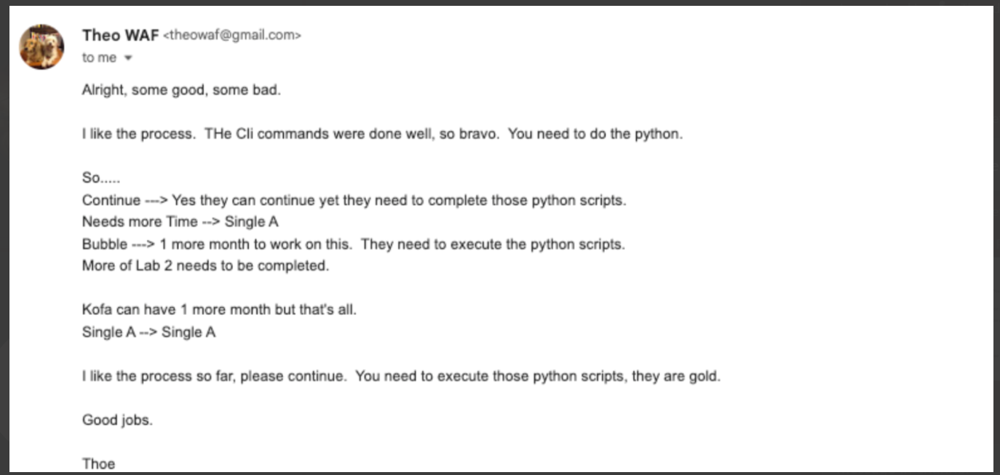
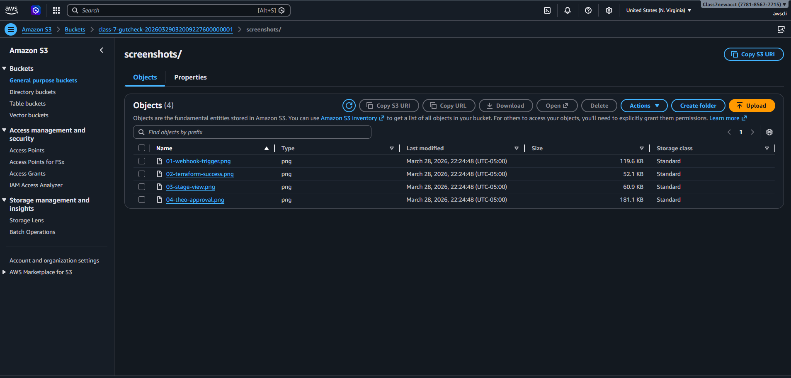

# Class 7 G-Check — Armageddon

## Repo
[https://github.com/BIGDADDY5802/class-7-gutcheck](https://github.com/BIGDADDY5802/class-7-gutcheck)

---

## Deliverables

### ✅ Working Webhook Trigger
- Started by GitHub push by **BIGDADDY5802**

---

### ✅ Successful Terraform Deployment via Jenkins
- Build status: **Finished: SUCCESS**

---

### ✅ Theo's Approval
- Email on file

---

## Evidence Files

All evidence files are hosted in a publicly accessible S3 bucket.

### ✅ S3 Bucket Contents

| Deliverable | URL |
|---|---|
| S3 Bucket | `class-7-gutcheck-20260329032009227600000001` |
| README | ./README.md |
| Webhook Trigger | https://class-7-gutcheck-20260329032009227600000001.s3.us-east-1.amazonaws.com/screenshots/01-webhook-trigger.png |
| Terraform Success | https://class-7-gutcheck-20260329032009227600000001.s3.us-east-1.amazonaws.com/screenshots/02-terraform-success.png |
| Stage View | https://class-7-gutcheck-20260329032009227600000001.s3.us-east-1.amazonaws.com/screenshots/03-stage-view.png |
| Theo Approval | https://class-7-gutcheck-20260329032009227600000001.s3.us-east-1.amazonaws.com/screenshots/04-theo-approval.png |
| Bucket Contents | https://class-7-gutcheck-20260329032009227600000001.s3.us-east-1.amazonaws.com/screenshots/05-bucket-files.png |
# class-7-gutcheck
